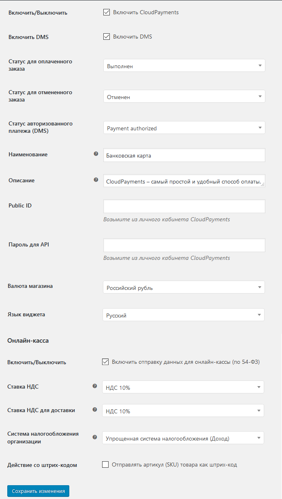
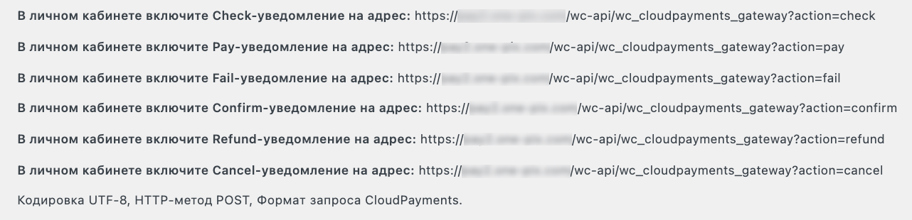

# CloudPayments module for WordPress - WooCommerce

Модуль позволит добавить на ваш сайт оплату банковскими картами через платежный сервис [CloudPayments](https://cloudpayments.ru/). 
Для корректной работы модуля необходима регистрация в сервисе.
Порядок регистрации описан в [документации CloudPayments](https://cloudpayments.ru/wiki/podkluchenie/poryadok_podkluchenia/123).

## Возможности:]

* Одностадийная схема оплаты;
* Двухстадийная схема;
* Оплата в 1 клик;
* Информирование СMS о статусе платежа;
* Выбор языка виджета;
* Выбор дизайна виджета;
* Возможность указать назначение платежа;
* Поддержка WooCommerce Subscriptions;
* Поддержка онлайн-касс (ФЗ-54);
* Отправка чеков по email;
* Отправка чеков по SMS;
* Теги способа и предмета расчета; 
* Отдельный параметр НДС для доставки.

## Совместимость:

WordPress 4.9.7 и выше;  
WooCommerce 3.4.4 и выше;

## Установка

Скопируйте папку `woocommerce-cloudpayments` в директорию `wp-content/plugins/` на вашем сервере.

Зайдите в "Управление сайтом" -> "Плагины". Активируйте плагин "WooCommerce CloudPayments Gateway".

В управлении сайтом зайдите в "WooCommerce" -> "Настройки" -> "Оплата" -> "CloudPayments". Отметьте галочкой  "Enable CloudPayments".

Настройте необходимые поля:  

* **Включить/Выключить** - Включение/Отключение платежной системы;  
* **Включить DMS** - Включение двухстадийной схемы оплата платежа (холдирование);
* **Тест оплаты заказа** - Можете настроить текст назначения платежа;  
* **Статус для оплаченного заказа** - **Обработка** (Если не предусматривается другой функционал);  
* **Статус для отмененного заказа** - **Отменен** (Если не предусматривается другой функционал);  
* **Статус авторизованоого платежа DMS** - **На удержании** (Или **Платеж авторизован**, если предусматривается другой функционал);  
* **Наименование** - Заголовок, который видит пользователь в процессе оформления заказа;  
* **Описание** - Описание метода оплаты;  
* **Public_id** - Public id сайта из личного кабинета CloudPayments;  
* **Password for API** - API Secret из личного кабинета CloudPayments;  
* **Валюта магазина** - Российский рубль (Если не предусматривается использовать другие валюты);  
* **Дизайн виджета** - Выбор дизайна виджета из 3 возожных (classic, modern, mini);  
* **Язык виджета** - Русский МСК (Если не предусматривается использовать другие языки).   

Использовать функцуионал онлайн касс:
* **Включить/Выключить** - Включение/отключение формирования онлайн-чека при оплате;  
* **ИНН** - ИНН вашей организации или ИП, на который зарегистрирована касса;  
* **Ставка НДС** - Укажите ставку НДС товаров;  
* **Ставка НДС для доставки** - Укажите ставку НДС службы доставки;  
* **Система налогообложения организации** - Тип системы налогообложения;  
* **Способ расчета** - признак способа расчета;  
* **Предмет расчета** - признак предмета расчета;  
* **Действие со штрих-кодом** - отправление артикула товара в чек как шрих-код;
* **Статус доставки** - **Выполнен** (Или **Доставлен**, если предусматривается другой функционал)  
_Отдельный статус доставки необходим при формировании двух чеков: один чек - при поступлении денег от покупателя, второй при отгрузке товара. Отправка второго чека возможна при следующих способах расчета: Предоплата, Предоплата 100%, Аванс._  

Нажмите "Сохранить изменения".

В личном кабинете CloudPayments зайдите в настройки сайта, пропишите в настройках уведомления, как описано на странице настройки модуля на указанный адрес:  

Вы готовы принимать платежи с банковских карт с помощью CloudPayments 

== Changelog ==

= 3.0 =
* Вовзращение плагина в маркетплейс;
* Код плагина переписан в соответствии со стандартами WP;
* Добавлена оплата в 1 клик с помощью токенов;
* Поддержка WooCommerce Subscriptions;

= 2.2.4 =
* минорные исправления

= 2.2.3 =
* минорные исправления

= 2.2.2 =
* Устранена ошибка fail уведомления.

= 2.2.1 =
* Устранены незначительные ошибки.

= 2.1 =
* Устранены некоторые ошибки в описании.

= 2.0 =
* Добавлен новый функционал.

= 1.0 =
* Размещение плагина в маркетплейс.

== Changelog == 

